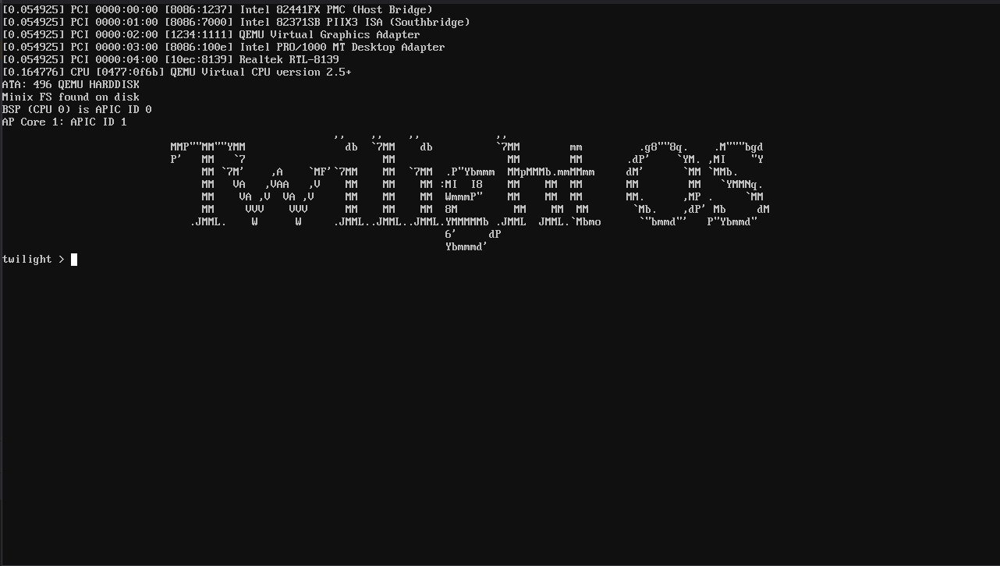

# Twilight OS

## Overview

Twilight OS is a lightweight operating system designed for general-purpose computing & embedded systems. It is written in Rust programming language.
It currently supports x86_64 architecture. future plans include support for ARM/RISC-V architecture.

## Features

- Lightweight and efficient
- Terminal support (kernel built-in)
- RTC
- ACPI - power off
- VFS & RamFS
- basic unix commands (kernel built-in)
- asynchronous I/O
- memory management
- frame buffer (/dev/fb0)
- ATA
- basic shell with shell history
- SMP detection (no multi-threading yet)

## Goal 0.1.0 Release

- [x] VFS & RamFS
- [x] Better user friendly Terminal
- [x] asynchronous I/O
- [x] memory management
- [x] PCI device detection
- [ ] EXT2 Filesystem
- [ ] Network Stack
- [ ] Userspace utilities

## Documentation

Twilight OS documentation is available at [https://twilight-os.vercel.app](https://twilight-os.vercel.app).

## License

Twilight OS is licensed under the BSD-3 Clause License. See the [LICENSE](LICENSE) file for details.

## Contributing

Contributions to Twilight OS are welcome!
