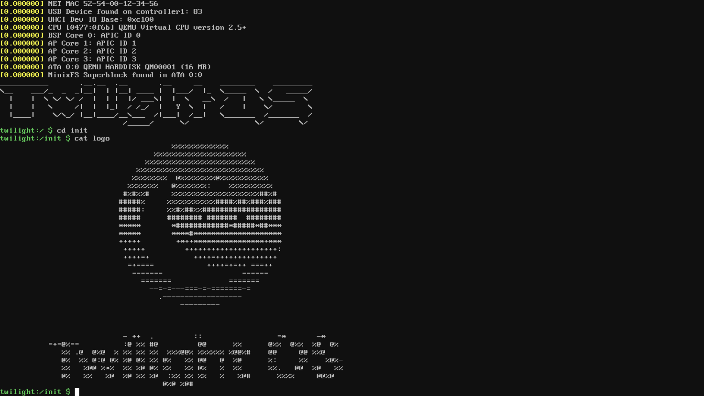
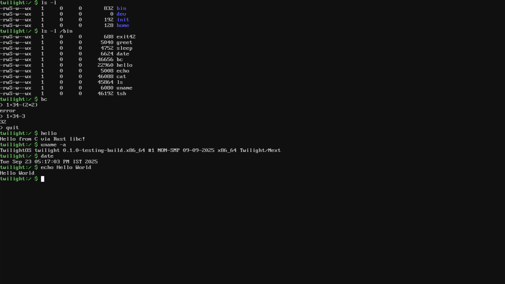
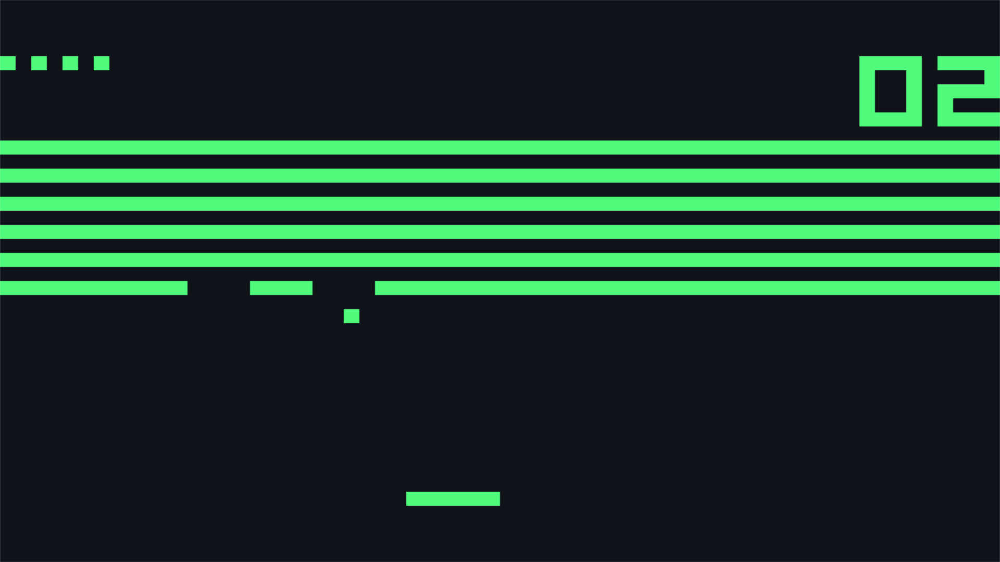
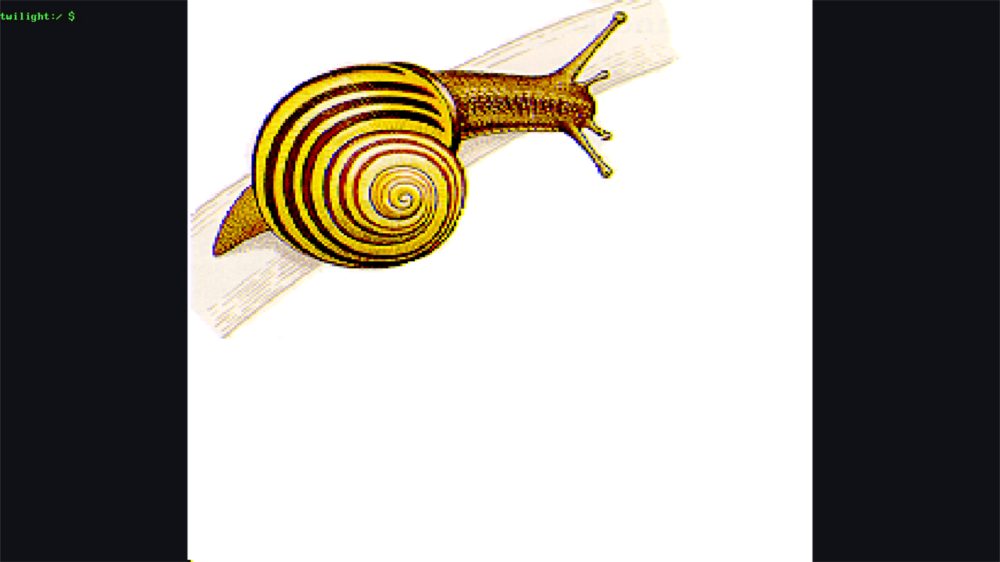

# Twilight OS

## Overview

Twilight OS is a lightweight, Unix-like operating system written in Rust, designed for general-purpose computing, embedded systems, and detailed OS dev learning. It bridges the gap between educational kernels and usable systems by implementing advanced features like dynamic binary loading, a self-hosting C compiler, and a custom filesystem.

It currently supports x86_64 architecture, with future plans for ARM/RISC-V.

## Screenshots

<table>
  <tr>
    <td></td>
    <td></td>
  </tr>
  <tr>
    <td></td>
    <td></td>
  </tr>
</table>

## Key Features

### Userspace & Tooling
- **Native C Compilation**: Includes `tcc` (Tiny C Compiler) to compile and run C programs directly within the OS.
- **Dynamic Binaries**: Full ELF shared object (`.so`) and dynamic executable support.
- **Scripting**: `tpy`, a Python-like interpreter for rapid scripting.
- **Shell & Utilities**: `tsh` (shell) with pipes/redirection, `grep`, `cat`, `ls`, `curl`, `vi` (modal editor).
- **Init System**: A modern `init` system capable of service management (`logind`, `httpd`).

### Kernel & Core
- **Language**: Written in pure Rust (no standard library).
- **Filesystem**: **TwilightFS** (TFS) - a custom, resilient filesystem with hot-file caching and efficient directory lookups. Also supports FAT16 (`/boot`) and VFS mount points.
- **Networking**: Custom network stack (TCP/UDP, DHCP, DNS) with drivers for RTL8139 and PCNET. Use `curl` to fetch pages!
- **Tasks**: Cooperative multitasking with an executor for async kernel tasks.
- **Drivers**:
    - **Storage**: ATA/IDE and VirtIO Block devices.
    - **Input**: PS/2 Keyboard & Mouse (`/dev/input/mice`).
    - **Display**: UEFI Framebuffer (`/dev/fb0`).
    - **Time**: RTC and CMOS support.

## Roadmap & Status

| Feature | Status | details |
| :--- | :--- | :--- |
| **Paging & Memory** | ✅ Done | Physical/Virtual allocation, User/Kernel separation |
| **VFS & TwilightFS** | ✅ Done | Custom on-disk format, mount points `/dev`, `/proc` |
| **Dynamic Linking** | ✅ Done | ELF loader, shared libraries support |
| **Networking** | ✅ Done | TCP/UDP stack, `httpd` server, `curl` client |
| **Userspace** | ✅ Done | `tcc`, `make` (partial), `vi`, `tpy` |
| **Multitasking** | 🚧 Beta | Cooperative scheduler, SMP detection (init) |
| **Graphics** | 🚧 Alpha | Framebuffer access, basic compositing |
| **Doom** | ⏳ Planned | Porting doomgeneric |

## Build Instructions

### ✅ Requirements

- **Rust** (nightly, via `rust-toolchain.toml`)
- `llvm-tools-preview`
- `nasm`, `ld` (binutils), `xorriso`
- `qemu` (emulator)
- `musl-gcc` (for userspace LibC)
- `cpio` (initramfs)

### ✅ Quick Start

1. **Install Dependencies** (Ubuntu/Debian example):
   ```bash
   sudo apt install build-essential nasm qemu-system-x86 xorriso gcc musl-tools cpio git curl
   rustup target add x86_64-unknown-none
   rustup component add llvm-tools-preview
   ```

2. **Build & Run**:
   ```bash
   make run
   ```
   *This downloads necessary bootloader files (Limine) and OVMF firmware automatically.*

3. **First Boot**:
   Inside the OS shell, initialize the disk:
   ```bash
   install
   ```
   Then reboot to use the persistent TwilightFS.

## Userspace Highlights

The `userspace/` directory contains a full suite of applications:
- **`apps/tcc`**: The compiler. Try `tcc -run hello.c`!
- **`apps/httpd`**: A non-blocking HTTP server serving `/var/www`.
- **`apps/vi`**: A functional clone of the classic editor.
- **`apps/chip8`**: A CHIP-8 emulator running in the terminal.

## Documentation

View the documentation online at [https://twilight-os.vercel.app](https://twilight-os.vercel.app).

## License

Twilight OS is licensed under the BSD-3 Clause License. See the [LICENSE](LICENSE) file for details.
